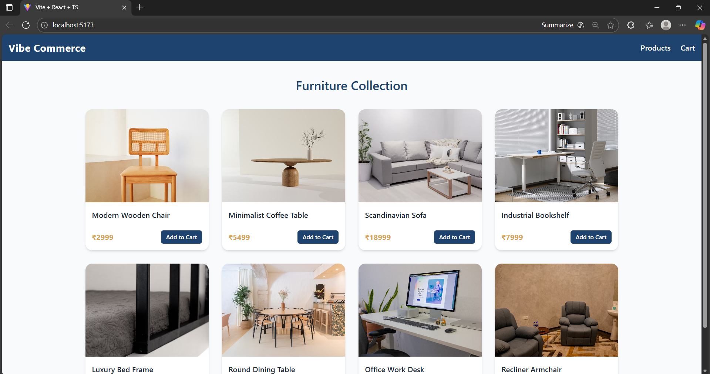
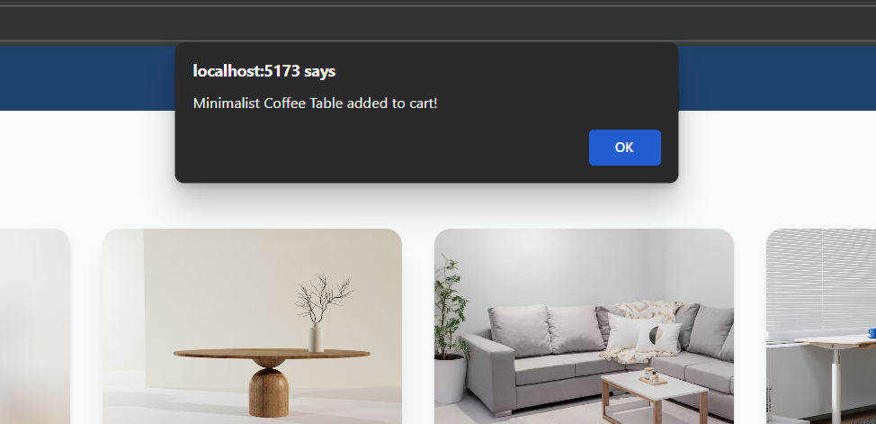
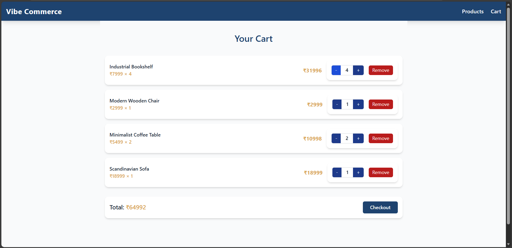
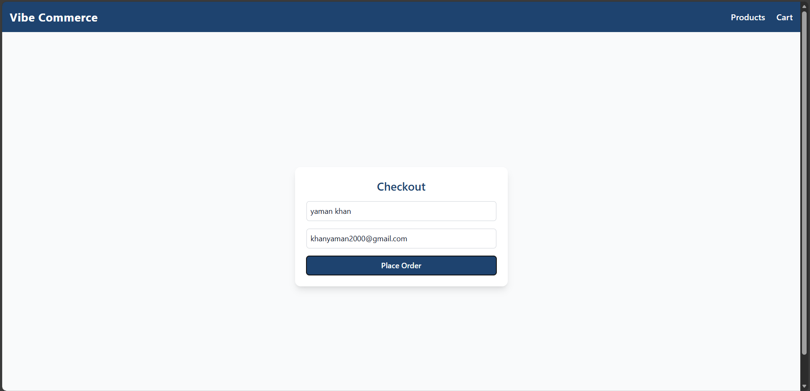
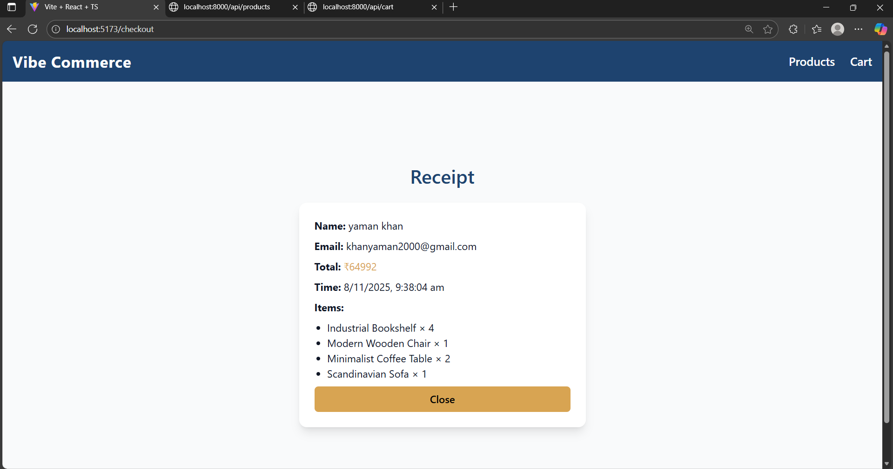
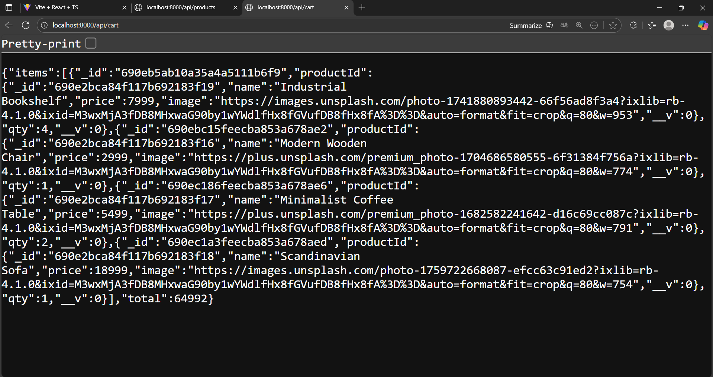
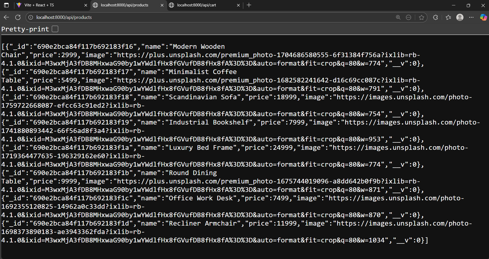

# 🛒 Vibe Commerce - Full Stack Mock E-Commerce App


---

## 📑 Table of Contents

- [💡 Project Overview](#project-overview)
- [✨ Key Features](#key-features)
- [🛠️ Tech Stack](#tech-stack)
- [📝 Getting Started](#getting-started)
  - [Prerequisites](#prerequisites)
  - [Installation Steps](#installation-steps)
- [📸 Usage / Screenshots](#usage--screenshots)
- [🔗 API Endpoints](#api-endpoints)
- [✉️ Contact / Acknowledgments](#contact--acknowledgments)

  ---

## 💡 Project Overview

**Vibe Commerce** is a **premium full-stack e-commerce application** built as a mock assignment for Vibe Commerce internship screening.  
It allows users to **browse products, manage a shopping cart, and complete a checkout flow** with a generated receipt.  

This project demonstrates:

- Seamless **frontend-backend integration** with React and Node.js/Express.  
- **REST API** design and usage.  
- **Database persistence** with MongoDB for cart and orders.  
- **Responsive design** for mobile and desktop.  

It is designed to be **high-quality, professional, and production-ready** in structure and design, focusing on trust, usability, and clean user experience.

---

## ✨ Key Features

- 🛍 **Product Catalog**: Browse 8 products with images, descriptions, and prices.  
- 🛒 **Shopping Cart**: Add/remove items, update quantities, and view real-time totals.  
- ✅ **Checkout**: Submit name and email to generate a **mock receipt** with timestamp and purchased items.  
- 💾 **Database Persistence**: Cart and orders saved in MongoDB.  
- 🌐 **Responsive Design**: Fully optimized for desktop, tablet, and mobile screens.  
- 🔧 **Error Handling**: Handles API errors and edge cases gracefully.  

---

## 🛠️ Tech Stack

- **Frontend:** React, TypeScript, Tailwind CSS, react-router-dom  
- **Backend:** Node.js, Express  
- **Database:** MongoDB (with Mongoose)  
- **HTTP Client:** Axios  
- **Version Control:** Git & GitHub  

---

## 📝 Getting Started

### Prerequisites

- Node.js v18+  
- npm or yarn  
- MongoDB (local or MongoDB Atlas account)  

---

### Installation Steps

1. **Clone the repository**
```bash
git clone https://github.com/Yamankhan23/vibe-commerce.git
cd vibe-commerce
````

2. **Install dependencies**

```bash
# Backend
cd backend
npm install

# Frontend
cd ../frontend
npm install
```

3. **Setup environment variables**
   Copy `.env.example` to `.env` in the `backend` folder:

```bash
cp .env.example .env
```

Update the `.env` values:

```env
MONGO_URI=<your_mongodb_connection_string>
PORT=8000
```

4. **Run the development servers**

```bash
# Backend
cd backend
npm run dev

# Frontend
cd ../frontend
npm run dev
```

5. **Access the application**

```
Frontend: http://localhost:5173
Backend API: http://localhost:8000/
```

---

📸 Usage / Screenshots
1. Home Page

Browse products on the home page.

<br>  <br><br>
2. Add to Cart

Add items to the shopping cart.

<br>  <br><br>
3. Cart Page

View and manage the cart (update quantities, remove items).

<br>  <br><br>
4. Checkout Page

Proceed to checkout, enter name and email.

<br>  <br><br>
5. Receipt Modal

View the receipt with total price, items, and timestamp.

<br>  <br><br>
6. Server API - GET /api/cart

Inspect API response for fetching cart items.

<br>  <br><br>
7. Server API - GET /api/products

Inspect API response for fetching products.

<br>  <br><br>

---

## 🔗 API Endpoints

| Endpoint        | Method | Description                                    |
| --------------- | ------ | ---------------------------------------------- |
| `/api/products` | GET    | Fetch all products                             |
| `/api/cart`     | GET    | Fetch current cart items + total               |
| `/api/cart`     | POST   | Add product to cart (`productId`, `qty`)       |
| `/api/cart/:id` | DELETE | Remove item from cart                          |
| `/api/checkout` | POST   | Submit cart, name/email → returns mock receipt |

> All endpoints return JSON responses with relevant data and messages.

---

## ✉️ Contact / Acknowledgments

**Developer:** Yaman Khan  
**GitHub:** [https://github.com/Yamankhan23](https://github.com/Yamankhan23)  
**Mail:** [khanyaman2000@gmail.com](mailto:khanyaman2000@gmail.com)

> Developed as a full-stack coding assignment for Vibe Commerce internship screening.
> All features implemented as per assignment requirements, including cart management, checkout, and mock receipt generation.


